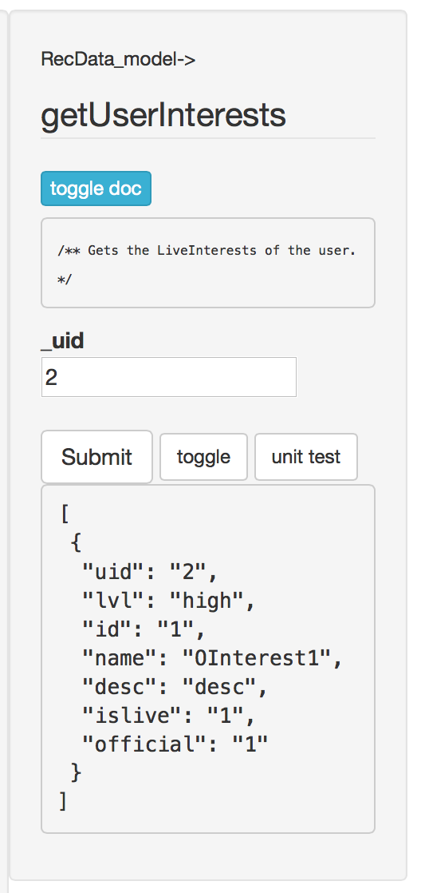

# ModelTester
A CodeIgniter interactive model tester web interface. Directly call your model functionality for testing and debugging.

## Usage
Load your controller into your browser: `http://<mydomain>/index.php/MyModelTester`. Then, click on a model and then enter parameters to pass to a method.  In the image below, there are two parameters to the method `toggleUserApp` in model `RecData_model`.



NOTE: If you use proper code documentation, it even prints to comments!


## Installation
* Copy `modeltester.php` into your CodeIgnite 'libraries' folder. 
* Create a new controller `MyModelTester.php` in your 'controllers' folder, passing in an array of the models you wish to test. ex "`array('model1_model','model2_model')`".
```
<?php if ( ! defined('BASEPATH')) exit('No direct script access allowed');
require_once(APPPATH.'libraries/modeltester.php');
class MyModelTester extends ModelTester {
    public function __construct() {
        parent::__construct(array(...my controllers here...));}}
?>
```
* That's it!


## How it works?

It sends an Ajax call to ModelTester->model_test and returns the results in JSON to your page. Nifty.

## Security Concerns

!GOOD HEAVENS YES! This is like handing the keys to your application to anyone that finds this controller. DON'T PUT INTO PRODUCTION CODE! To mitigate this risk, it does not function if you set your CodeIgniter project state to anything other than 'development' and you can turn it off by setting the second parameter to ModelTester to be false.

## What's with the 'Unit Tests'?

I have unit tests per model. I use Toast to do this. Either ignore those links and buttons, or create some unit tests.
