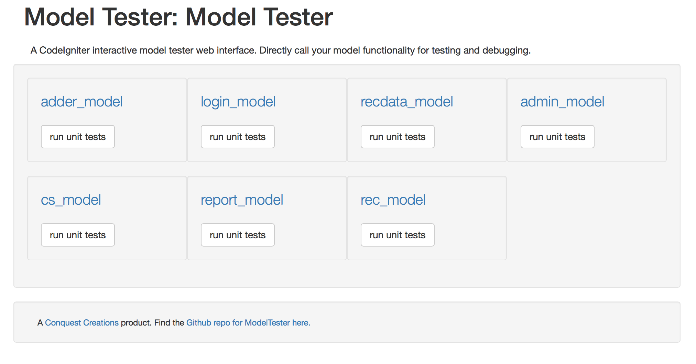
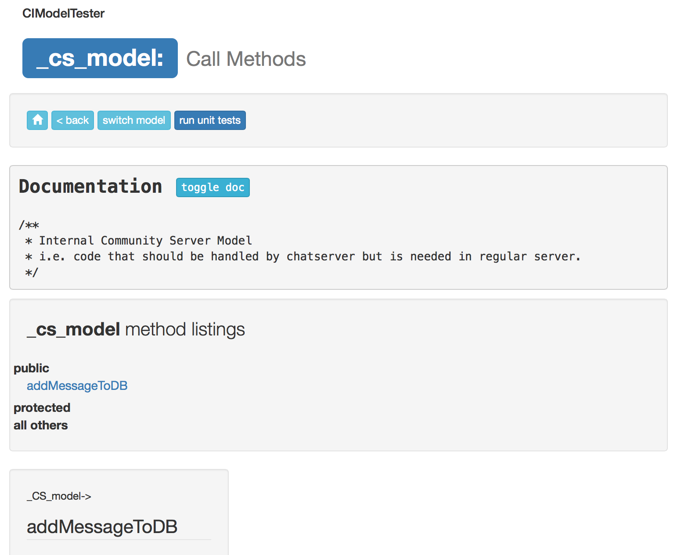
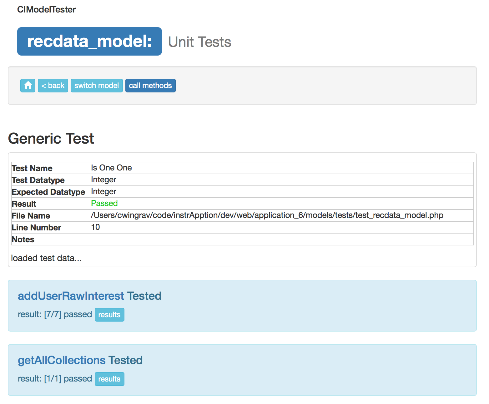

# CIModelTester
A CodeIgniter interactive model tester web interface. Directly call your model functionality for testing and debugging.

## Usage
Load in your browser: `http://<mydomain>/index.php/CIModelTester`. You'll see the main CIModelTester page.



Then, click on a model to see the model page. 



From here, type parameters into the fields to pass data to a method.  In the image below, there are two parameters to the method `toggleUserApp` in model `RecData_model`.


NOTE: If you use proper code documentation, it even prints to comments!


## Installation

### Quick Install
* Put `modeltester.php` into your controllers directory.

### For Tailored Use
* Put `modeltester.php` into your CodeIgnite 'libraries' folder. 
* Create a new controller `MyModelTester.php` in your 'controllers' folder, passing in an array of the models you wish to test. ex "`array('model1_model','model2_model')`".
```
<?php if ( ! defined('BASEPATH')) exit('No direct script access allowed');
require_once(APPPATH.'libraries/modeltester.php');
class MyModelTester extends CIModelTester {
    public function __construct() {
        parent::__construct(array(...my controllers here...));}}
?>
```
* That's it! Load it up at http://<mydomain>/index.php/MyModelTester


## Unit Testing Models

You can write CodeIngniter unit tests for your models and run them via this interface. Open the model and click 'run unit tests'. It will load the APPDATA/models/tests/test_[modelname].php file and execute the tests. If this file does not exist, it gives you sample data to get started writing one and tells you the directory location to put it. (NOTE: For models in subdirectories, create your 'tests' directory in those subdirectories. Nifty huh...)

### Testing Methods Run
This runs a generic test and searches for method-specific tests.
* test()   - always called.
* onExit() - called at the end of running your model. 
* test_\[method\]() - the test method for you to implement. Returned values are displayed after the CodeIgniter unit test information. Use the pack_ret function to format any data in this method for return.

### Default Unit Test
Here's what the suggested unit test is for my 'content_model.php' file, where I wrote one empty test for the method test_getUnderReviewStats.


## How it works?

It sends an Ajax call to CIModelTester->model_test and returns the results in JSON to your page. Nifty.

## Security Concerns

!GOOD HEAVENS YES! This is like handing the keys to your application to anyone that finds this controller. DON'T PUT INTO PRODUCTION CODE! To mitigate this risk, it does not function if you set your CodeIgniter project state to anything other than 'development' or 'testing' and you can turn it off by setting the second parameter to CIModelTester to be false.

Also, for unit tests, only runs in 'testing' environment.
